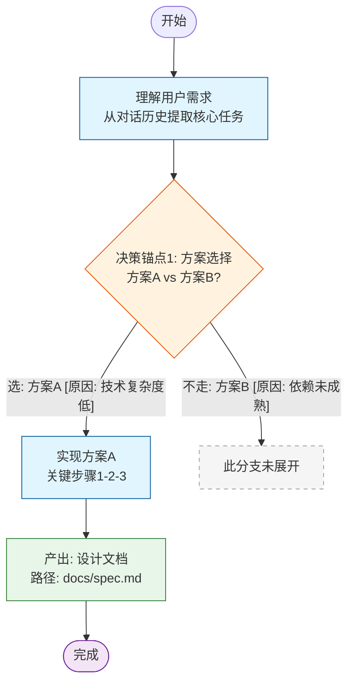

## 能力说明

- 本能力用于记录和管理 Agent 每次会话的完整存档，同时支持基于历史数据源初始化存档内容。系统自动捕获和结构化会话过程中的关键信息，包括对话标题、用户输入、核心任务、实现方案、问题解决过程、用户纠正记录等。通过系统化的存档机制，为后续会话提供上下文参考，避免重复沟通，提升协作效率。

- 支持从多种历史数据源（Git提交记录、项目文档、任务列表等）初始化会话存档，方便用户在首次使用或新建项目时快速建立历史上下文。

- 存储模式说明：每次会话独立存储为一个 md 文件到 `TIMELINE/` 文件夹下，文件名为会话主题。同日目录下维护一个 `INDEX.md` 索引文件，按会话创建时间从上到下排列，每条索引包含会话主题、创建时间、摘要、使用次数（短期/长期）和 wikilink 详情链接。

## 核心职责

- **会话信息捕获** — 自动识别和提取会话中的关键信息节点
- **结构化存储** — 将会话信息按照标准格式组织存储为独立文件
- **智能总结** — 对长对话进行智能摘要和标题生成（摘要仅写入 INDEX.md 索引）
- **问题追踪** — 记录问题发现、解决过程和最终方案
- **纠正记录** — 追踪用户纠正次数、纠正内容和解决方式
- **存档管理** — 支持存档的创建、索引维护、查询和检索
- **历史数据初始化** — 支持从Git提交记录、项目文档等数据源导入历史上下文

## 输入

### 场景一：会话后存档

- **会话上下文**：完整的对话历史记录
- **用户原始输入**：用户在会话中提出的所有原始需求描述
- **执行过程**：任务执行过程中的关键步骤和决策
- **问题记录**：遇到的问题、错误信息和异常情况
- **纠正记录**：用户提出的纠正意见和调整要求
- **最终结果**：任务完成后的最终输出和交付物

### 场景二：历史数据初始化

- **Git提交记录**：项目仓库的提交历史，包含提交信息、提交人、时间戳、变更文件等
- **项目文档**：需求文档、技术方案、会议纪要、任务清单等
- **历史存档**：已有的TIMELINE存档文件
- **任务追踪数据**：Issue跟踪系统、敏捷看板等任务管理数据
- **代码审查记录**：PR/MR记录、代码审查意见

## 输出

- 每次会话独立存储为一个 md 文件到 `TIMELINE/` 文件夹下，文件名为会话主题
- 同日目录下维护 `INDEX.md` 索引文件，按创建时间从上到下排列，通过`wikilink` 链接到详情文件

## 工作流程

### 场景一：会话后存档

#### 步骤1：会话信息收集
- 收集完整的对话历史记录
- 提取所有用户原始输入内容
- 记录每个关键节点的系统响应
- 统计对话轮次和交互次数

#### 步骤2：生成会话标题
- 分析会话的核心主题和关键词
- 提取用户需求的核心意图
- 生成简洁准确的会话标题（不超过50字）
- 标题格式：`[任务类型] + [核心内容]`
- 示例：`[代码重构] 优化用户登录模块性能`

#### 步骤3：生成对话总结摘要
- 按时间顺序梳理对话流程
- 提取关键决策点和转折点
- 总结用户需求的核心要点
- 概括任务执行的主要步骤
- 摘要长度控制在200-300字
- 摘要结构：背景 -> 需求 -> 执行 -> 结果
- 摘要仅写入 INDEX.md 索引条目中，不写入会话详情文件

#### 步骤4：识别核心任务
- 从用户输入中提取核心任务描述
- 识别任务的优先级和紧急程度
- 明确任务的验收标准和期望结果
- 区分主要任务和次要任务
- 记录任务的依赖关系和前置条件

#### 步骤5：生成会话思维树
- 根据整场会话的详细内容，绘制会话思维树流程图
- 遵循以下规则：
  - **识别决策锚点**：所有二选一或多选一的讨论点，标记为 `决策锚点N: 决策标题`
  - **分支标签**：被采纳的分支标注 `"选: 方案名称 [原因: 一句话原因]"`，未采纳的分支标注 `"不走: 方案名称 [原因: 一句话原因]"`
  - **标注产出物**：当会话产出了文件、代码、文档等具体产物时，标注为 `产出: 产物描述`，并链接到实际文件路径
  - **节点类型**：按「普通阶段/任务」「决策点」「产出物」「最终完成」「未走分支」分别使用对应样式
  - **节点数**：控制在15-25个，决策锚点不超过5个，产出物节点不超过5个
  - **特殊字符转义**：花括号、尖括号、管道符等用双引号包裹
  - **分支标签**：所有箭头上的文字必须用双引号包裹
- 将生成的 mermaid 代码块写入会话详情文件的「会话思维树」章节

#### 步骤6：记录实现方案
- 详细记录最终采用的实现方案
- 说明方案的技术选型和架构设计
- 列出实现的关键步骤和操作
- 记录使用的工具、框架和依赖
- 说明方案的优缺点和适用场景

#### 步骤7：追踪问题解决过程
- 记录遇到的所有问题和错误
- 分析问题的根本原因
- 记录问题的排查过程和诊断方法
- 详细说明解决方案和修复步骤
- 总结问题的预防措施和经验教训
- 问题记录格式：
  ```
  问题N: [问题描述]
  - 发现时间: [时间戳]
  - 错误信息: [具体错误]
  - 根本原因: [原因分析]
  - 解决方案: [详细步骤]
  - 预防措施: [改进建议]
  ```

#### 步骤8：记录用户纠正过程
- 统计用户纠正的总次数
- 记录每次纠正的具体内容
- 分析纠正的原因和背景
- 说明如何响应用户的纠正
- 记录纠正后的调整方案
- 纠正记录格式：
  ```
  纠正N: [纠正内容]
  - 纠正时间: [时间戳]
  - 纠正原因: [用户反馈]
  - 响应方式: [如何处理]
  - 调整方案: [具体调整]
  ```

#### 步骤9：识别并记录关联记忆时间线
- 前置条件：会话开始时搜索过记忆时间线（搜索结果中命中的历史会话即为候选关联目标）
- 回顾本次会话中实际参考或复用了哪些历史会话的内容，从候选关联目标中筛选出真正产生关联的条目
- 对每个关联条目，用一句简短的关联说明概括本次会话与该历史会话的关系（如"延续上次未完成的接口开发"、"修复上次方案的边界问题"）
- 以 `**[关联说明]**: [[path|reference]]` 格式写入会话详情文件的"关联记忆时间线"章节
- 强制：如果会话开始时没有搜索过记忆时间线 那么代表未产生实际关联 禁止写入该章节 直接跳过 
- 强制：如果会话开始时搜索过记忆时间线 在写入`关联记忆时间线`章节的时候 你要先搜索一次 确保需要关联的记忆时间线文件已经存在

#### 步骤10：存储会话文件并更新索引
- 检查当日目录 `{YYYY-MM-DD}/TIMELINE/` 是否存在，不存在则创建
- 将会话内容写入独立文件 `{YYYY-MM-DD}/TIMELINE/{会话主题}.md`
- 文件名中的特殊字符替换为下划线
- 创建或更新 `{YYYY-MM-DD}/INDEX.md` 索引文件
- 索引按创建时间从上到下追加新条目（包含主题、创建时间、摘要、使用次数默认为0、wikilink）
- 验证信息的完整性和准确性

#### 步骤11：更新采纳文档的使用次数
- 先通过`采纳判定标准`判断搜索结果是否被采纳 如果搜索结果被采纳 那么需更新被采纳文档的`INDEX.md`中文档的使用次数
  - 采纳判定标准：该时间线文件的内容解决了用户的搜索目标/回答了用户搜索目标的90%以上(并不是读取了文件就认为被采纳了)
  - 判断短期/长期的依据：对比该会话详情文件所在日期文件夹的日期（`{YYYY-MM-DD}`）与当前日期的差值
    - **不超过7天**：更新使用次数（短期）+1
    - **超过7天**：更新使用次数（长期）+1
- 只可以更新`INDEX.md` 索引中采纳文档的条目中的使用次数字段
- 只可以更新搜索范围内的被采纳文档的采纳数

### 场景二：历史数据初始化

#### 步骤1：数据源识别与接入
- 识别可用的历史数据源类型
- 检查数据源的可访问性和数据质量
- 配置数据源接入参数（仓库地址、文档路径等）
- 支持的数据源：
  - Git仓库（通过git log获取提交记录）
  - 项目文档目录（Markdown、文本文件）
  - 已有TIMELINE存档文件

#### 步骤2：数据提取与解析
- **Git提交记录提取**：
  - 获取指定时间范围的提交历史
  - 解析提交信息，提取任务相关关键词
  - 识别功能开发、bug修复、文档更新等类型
  - 提取提交关联的变更文件列表
- **项目文档解析**：
  - 扫描文档目录，识别需求文档、技术方案
  - 提取文档中的任务描述、里程碑信息
  - 识别文档更新时间，确定时效性
- **历史存档整合**：
  - 读取现有TIMELINE存档文件（兼容旧格式 `TIMELINE.md` 单文件和新格式 `TIMELINE/` 文件夹）
  - 提取历史任务、问题、解决方案

#### 步骤3：上下文生成
- 基于提取的数据生成项目背景摘要
- 识别项目的发展历程和关键里程碑
- 提取活跃的开发任务和待解决问题
- 生成历史技术栈和架构演进信息
- 整理历史问题和解决方案知识库

#### 步骤4：初始化存档创建
- 创建包含历史上下文的初始化存档
- 每个历史条目存储为独立文件到 `{YYYY-MM-DD}/TIMELINE/` 文件夹下
- 同步生成 `{YYYY-MM-DD}/INDEX.md` 索引文件
- 添加"历史数据来源"说明
- 标记存档为"初始化"类型

#### 步骤5：增量更新机制
- 定期检查数据源更新
- 支持增量同步新的提交和文档
- 保持存档与实际项目状态同步
- 记录数据源同步时间戳

### 场景三：时间线搜索

#### 步骤1：确定搜索时间范围
- 根据用户需求确定需要搜索的时间范围（默认最近7天）
- 使用 Bash 查看当前日期，计算目标日期范围
- 列出时间范围内所有 `{YYYY-MM-DD}` 日期文件夹

#### 步骤2：查看 INDEX.md 索引
- 按日期从近到远依次读取各日期文件夹下的 `INDEX.md`
- 在 INDEX.md 中搜索与目标关键词匹配的内容（匹配会话主题、摘要）
- 如果 INDEX.md 中包含匹配内容，记录对应的会话主题和 wikilink 详情链接

#### 步骤3：深入读取会话详情
- 对于 INDEX.md 中匹配到的会话条目，通过 wikilink 链接定位到具体的详情文件
- 读取详情文件内容，提取用户需要的信息
- 如果详情文件内容中包含更详细的匹配信息，返回给用户
- 如果详情文件内容中包含`关联记忆时间线`你也要查看相关的关联记忆时间线 最多深入5层

#### 步骤4：无匹配结果处理
- 如果所有日期的 INDEX.md 中均未找到匹配内容 进入降级策略
  - **降级策略**：当`INDEX.md`未找到匹配内容时 允许对指定日期范围内的详情文件进行关键词搜索
- 不得编造或猜测不存在的会话内容

#### 步骤5：展示搜索结果
- 搜索结果必须包含：
  - 1.搜索匹配的结果内容
  - 2.文档的相对路径
- **强制输出**：每个匹配条目的详情文件完整路径必须随搜索结果一起输出 供存档时"识别并记录关联记忆时间线"步骤使用

#### 搜索策略要点
- **先索引后详情**：始终先查看 INDEX.md，只有索引匹配时才深入读取详情文件
- **避免全量扫描**：禁止直接遍历 `{YYYY-MM-DD}/TIMELINE/` 文件夹下所有详情文件
- **快速失败**：INDEX.md 无匹配则立即跳过该日期 不做多余读取

## 输出结构

### 目录结构

```
.timelines/{YYYY-MM-DD}/
  ├── INDEX.md              # 索引文件，与TIMELINE文件夹同级
  └── TIMELINE/             # 会话详情文件夹
      ├── [会话主题A].md    # 单个会话详情
      ├── [会话主题B].md
      └── [会话主题C].md
```

### INDEX.md 格式

```markdown
## 会话索引

### [会话主题A]
- **创建时间**: YYYY-MM-DD HH:mm:ss
- **摘要**: [200-300字摘要]
- **使用次数(短期)**: 0
- **使用次数(长期)**: 0
- **详情**: [[`.timelines/{YYYY-MM-DD}/TIMELINE/[会话主题A].md`]]

### [会话主题B]
- **创建时间**: YYYY-MM-DD HH:mm:ss
- **摘要**: [200-300字摘要]
- **使用次数(短期)**: 0
- **使用次数(长期)**: 0
- **详情**: [[`.timelines/{YYYY-MM-DD}/TIMELINE/[会话主题B].md`]]
```

### 会话详情文件格式

```markdown
## [会话标题]

### 元数据
- **数据源类型**: [当前会话/Git历史记录/文档]

### 用户首次输入内容
- **时间**: [时间戳]
- **内容**: [用户原始输入内容]

### 核心任务
- **任务描述**: [核心任务的详细描述]
- **优先级**: [高/中/低]
- **验收标准**: [具体的验收标准]
- **期望结果**: [用户期望的最终结果]

### 会话详细内容
- 记录对话的详细内容
- 要求不得少于300字
- 强制使用```text ``` 代码块去记录
```text
[会话详情信息]
```

### 会话思维树
- 使用 mermaid 画一个流程图
- 记录整场会话的详细内容的思维树
- 流程图须遵循以下绘制规则：

**节点类型与样式**

| 节点类型 | Mermaid 形状 | 样式 class | 说明 |
|----------|-------------|------------|------|
| 普通阶段/任务 | 方框 `[...]` | `milestone` | 蓝色填充 |
| 决策点 | 菱形 `{...}` | `decision` | 橙色填充 |
| 产出物 | 方框 `[...]` | `output` | 绿色填充 |
| 最终完成 | 圆角框 `([...])` | `done` | 紫色填充 |
| 未走分支 | 方框 `[...]` | `skipped` | 灰色虚线 |

**决策锚点识别规则**
- 识别对话中所有二选一或多选一的讨论点
- 标记为 `决策锚点N: 决策标题`
- 分支标签必须包含：
  - 被采纳的分支：`"选: 方案名称 [原因: 一句话原因]"`
  - 未采纳的分支：`"不走: 方案名称 [原因: 一句话原因]"`

**产出物标注规则**
- 当会话产出了文件、代码、文档、图表等具体产物时，在流程图中标注为 `产出: 产物描述`
- 产出物节点应链接到实际文件路径（如果路径中包含特殊字符，用双引号包裹）

**特殊字符转义规则**
- 花括号 `{}` → 用双引号包裹整个节点文本
- 换行 → 使用 HTML `<br>` 标签
- 尖括号 `<>` → 用双引号包裹
- 管道符 `|` → 只能在分支标签中使用，且标签需用双引号包裹

**分支标签规则**
- 所有分支标签文本（箭头上的文字）必须用双引号包裹

**流程图构成原则**
- 节点数控制在 15-25 个，超过则考虑分层
- 决策锚点不超过 5 个
- 产出物节点不超过 5 个
- 分支标签简短，原因控制在 15 字以内
- 始终包含"未走分支"



### 关键决策表

| 锚点 | 决策 | 选择 | 核心原因 | 未选方案 |
|------|------|------|----------|----------|
| 1 | 方案选择 | 方案A | 技术复杂度低 | 方案B |
| 2 | ... | ... | ... | ... |

### 关键产出物清单

| 产出物 | 路径 | 说明 |
|--------|------|------|
| 设计文档 | `docs/spec.md` | 完整设计 |
| 代码仓库 | `repo.git` | 实现代码 |

### 实现方案
- **方案概述**: [方案的总体描述]
- **技术选型**: [使用的技术栈]
- **架构设计**: [架构说明]
- **关键步骤**:
  1. [步骤1]
  2. [步骤2]
  3. [步骤3]
- **依赖项**: [外部依赖和前置条件]

### 问题解决记录
#### 问题1: [问题标题]
- **发现时间**: [时间戳]
- **问题描述**: [详细描述]
- **错误信息**: [具体错误]
- **根本原因**: [原因分析]
- **解决方案**: [详细步骤]
- **预防措施**: [改进建议]
#### 问题2: ...
### 用户纠正记录
#### 纠正1: [纠正内容]
- **纠正时间**: [时间戳]
- **纠正原因**: [用户反馈]
- **响应方式**: [如何处理]
- **调整方案**: [具体调整]

#### 纠正2: ...

### 最终结果
- **交付物**: [最终产出的内容]
- **完成状态**: [已完成/部分完成/未完成]
- **质量评估**: [自我评估]
- **后续建议**: [改进建议]

### 经验总结
- **成功经验**: [做得好的地方]
- **改进空间**: [需要改进的地方]
- **知识沉淀**: [可复用的经验]

### 业务知识
- **业务领域**: [本次会话涉及的业务领域]
- **业务规则**: [相关的业务规则和约束]
- **业务流程**: [涉及的业务流程和链路]
- **关键概念**: [需要理解的业务概念和术语]

### 关联记忆时间线
- **[关联说明]**: [[`.timelines/{YYYY-MM-DD}/TIMELINE/{会话主题}.md`|reference]]
```

## 强制规则

### 存储规则
- 每次会话必须存储为独立文件到 `TIMELINE/` 文件夹下
- 文件名使用会话主题（不超过50字），特殊字符替换为下划线
- 每次存储后必须更新 INDEX.md 索引
- 索引条目按创建时间从上到下排列
- INDEX.md 中每个条目必须包含创建时间、摘要、使用次数（短期/长期）和 wikilink 详情链接
- 新增 INDEX.md 条目时，使用次数（短期）和使用次数（长期）默认值均为 0
- 每次存档操作只允许做如下的事情：新增一个会话详情文件、更新会话详情文件中`关联记忆时间线部分`、更新INDEX.md索引、更新采纳的文档在INDEX.md的使用数量
- 关联记忆时间线为可选章节，无关联时不写入
- 关联目标必须是已存在的历史会话 目标不存在则该条目不写入
- 仅在当前会话详情文件中写入关联 禁止修改已有会话详情文件

### 信息收集
- 必须完整记录所有用户原始输入，不得遗漏
- 用户首次输入内容中的时间戳必须准确记录
- INDEX.md 条目中的创建时间必须准确记录，精确到秒
- 必须区分主要任务和次要任务
- 必须记录所有问题和纠正，不得隐瞒
- 初始化场景下必须标注数据来源

### 内容质量
- 会话标题必须简洁准确，不超过50字
- INDEX.md 中的摘要必须控制在200-300字
- 历史上下文摘要控制在300-500字
- 问题记录必须包含根本原因分析
- 纠正记录必须说明响应方式和调整方案

### 存档管理
- 路径基准：当前项目根目录下的 `.timelines/`，禁止使用全局路径 `~/.timelines/`
- 会话文件存储路径：`.timelines/{YYYY-MM-DD}/TIMELINE/`
- 会话文件命名格式：`{会话主题}.md`
- 索引文件路径：`.timelines/{YYYY-MM-DD}/INDEX.md`
- 每次会话结束后只能够创建会话详情文件并更新索引
- 初始化存档根据需要手动触发
- 存档文件必须包含完整的元数据

### 客观性
- 必须如实记录问题和纠正，不得美化
- 必须客观描述实现过程，不得夸大
- 必须准确反映用户反馈，不得曲解
- 必须基于事实记录，不得编造
- 历史数据必须如实转录，不做过度解读

### 数据源接入
- 必须验证数据源可访问性
- 必须处理数据源认证信息
- 必须处理数据源格式差异
- 必须记录数据源同步状态

## 注意事项
- **强制路径约束**：所有时间线的读取和存储路径必须是当前项目根目录下的 `.timelines/`，禁止使用全局路径 `~/.timelines/`。当前项目根目录即为 Agent 启动时的工作目录
- 存档内容必须基于实际对话或真实历史数据 不得编造
- `.timelines/{YYYY-MM-DD}/` 中的 `YYYY-MM-DD` 强制使用 Bash 查看日期命令获取
- 会话详情文件存储在 `{YYYY-MM-DD}/TIMELINE/` 文件夹下，文件名为会话主题
- 通过 INDEX.md 索引定位会话，再通过 wikilink 通过文件路径跳转到详情文件 循环往复 最大查看深度为10层
- Git提交记录提取建议限制时间范围，避免数据量过大
- 敏感信息（如认证Token、密码等）不得记录到存档中
- `用户纠正记录` 指的是Agent执行或者做了和用户预期不一致的行为或者结果 然后用户让Agent该如何做叫做纠正 不是项目报错 或者说bug 就是Agent做了一些和用户预期不符合的事情
- 如果使用`Git`初始化那么必须**按照Git的提交的时间**将git变更详细查看然后按照TIMELINE格式的要求存储到 `TIMELINE/` 文件夹下并更新 INDEX.md
- 不需要记录`/time`、`/time-start`、`timeline-search-agent`的等操作`TIMELINE`的记录到存档中 避免无限循环
- 搜索时间线时必须遵循「先索引后详情」策略：先读取 INDEX.md 通过文档标题和摘要匹配内容 匹配到再通过 wikilink 读取详情文件 实在搜索不到可以使用降级策略
- 搜索时间线时默认搜索最近7天，同时强制使用Bash查看当前时间
- 强制按照`输出格式`输出 尤其是(INDEX.md格式和会话详情文档格式)

## 使用场景

### 场景1：任务完成后存档
- 用户完成一个复杂的开发任务
- 系统自动创建独立的会话详情文件并更新索引
- 记录任务从需求到交付的全过程

### 场景2：问题排查回顾
- 用户遇到类似问题需要参考历史解决方案
- 通过 INDEX.md 索引快速定位相关会话
- 通过 wikilink 跳转到详情文件查看解决方案
- 避免重复排查，提升效率

### 场景3：团队协作交接
- 开发人员交接工作时提供会话存档
- 新成员通过 INDEX.md 快速了解任务背景
- 通过 wikilink 深入查看具体实现细节
- 减少沟通成本，加速上手

### 场景4：经验沉淀复用
- 定期回顾历史存档，提取成功经验
- 将常见问题和解决方案整理成知识库
- 通过业务知识部分积累领域知识
- 提升团队整体能力

### 场景5：审计追溯
- 需要追溯某个任务的决策过程
- 通过存档还原完整的对话历史
- 支持问题复盘和责任追溯

### 场景6：首次使用初始化
- 用户首次使用Agent
- 想快速建立项目历史上下文
- 从Git提交记录和文档中提取信息
- 生成初始化存档作为会话起点

### 场景7：新项目接入
- 用户开始一个新项目
- 需要从零建立任务追踪体系
- 导入已有的项目文档和任务列表
- 快速进入工作状态

### 场景8：项目重启
- 长时间未处理的项目重新启动
- 需要回顾项目历史状态
- 从Git历史中提取未完成任务
- 同步最新项目进展

### 场景9：同日多任务处理
- 用户在同一天完成多个独立任务
- 每个任务存储为独立的会话详情文件
- 通过 INDEX.md 索引快速导航到具体任务

## 可量化指标

### 完整性指标
- **用户输入覆盖率**: 100%（所有用户输入必须记录）
- **问题记录完整度**: 100%（所有问题必须记录）
- **纠正记录完整度**: 100%（所有纠正必须记录）
- **元数据完整度**: 100%（所有元数据必须填写）
- **数据源覆盖率**: >=80%（初始化场景下主要数据源已接入）

### 质量指标
- **标题准确度**: >=90%（标题准确反映会话主题）
- **摘要相关性**: >=85%（摘要涵盖关键信息）
- **历史上下文相关性**: >=80%（初始化存档包含相关历史信息）
- **问题分析深度**: >=80%（包含根本原因分析）
- **纠正响应及时性**: 100%（所有纠正都有响应）

### 效率指标
- **存档生成时间**: <=30秒（会话结束后）
- **初始化生成时间**: <=60秒（历史数据处理）
- **摘要长度**: 200-300字（会话）/ 300-500字（初始化）
- **标题长度**: <=50字

### 可用性指标
- **存档检索成功率**: >=95%（能快速找到历史存档）
- **信息可读性**: >=90%（结构清晰，易于理解）
- **格式规范性**: 100%（符合标准格式）
- **数据源兼容性**: >=85%（支持多种历史数据源格式）